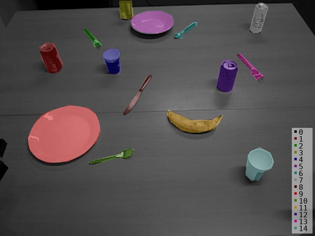

# **H**ousehold **O**bjects in **T**abletop **S**cenes

  

HOTS in an ongoing effort to collect an RGB-D dataset aimed for benchmarking visual and 3D recognition, sim-to-real domain adaptation (and more) in robotics-related domains. It contains a broad range of typical household objects annotated in multiple levels of granularity for class labels (supercategory, category and instance), as well as visual attribute annotations (color, material etc.) and pair-wise spatial relations in the scene-level (scene graphs). The current version of the dataset contains only single view RGB-D data captured from an ASUS Xtion sensor mounted on a real-robot setup.

The dataset enumerates a total of 46 object instances organized as
| Annotation        | Number           | Classes  |
| ------------- |:-------------:| :-----|
| Supercategory      | 5 | edible products(13), electronics(5), fruits(6), kitchenware(11), stationery(11) | 
| Category    | 25   |   apple(1), banana(1), book(3), bowl(1), soda can(5), cup(3), fork(2), juice box(3), keyboard(1), knife(1), laptop(1), lemon(1), marker(2), milk box(2), monitor(1), mouse(2), orange(1), peach(1), pear(1), pen(3), plate(2), pringles box(3), scissors(2), spoon(2), stapler(1)   |
| Color | 11      |    red(6), yellow(4), blue(5), white(6), purple(2), green(4), black(9), transparent(1), silver(6), orange(2), pink(1) |
| Material | 7      |    organic(6), paper(7), ceramic(5), aluminium(5), glass(1), metal(8), plastic(14) |

# Data Structure
Run the download script to retrieve the dataset. 
```bash
python download_dataset.py --source_dir PATH_TO_REPO_ROOT
```
This will generate two sub-folders, namely: a) *object*, that containts object-level RGB-D images aimed for object recognition task, cropped from the original scene frames according to their bounding box annotation, and b) *scene*, that contains scene-level RGB-D images, organized by title in different splits according to the type of objects appearing (table, kitchen, office, mix). Annotations contain bounding boxes for object detection and pixel-level masks for semantic / instance segmentation tasks.

The object-level directory structure follows the classic *ImageFolder* class-per-folder style:
```bash
#  - object
#    - RGB
#      - apple
#        - 0.png
#        - 1.png
#        - ...
#      ...
#      - stapler
#        - 0.png
#        - 1.png
#        - ...
#     - Depth
#        - ...
#     - labels.txt
```

The scene-level directory follows the VOC-style structure for each task

Image data
```bash
#  - ./HOTS/scene
#    - RGB
#      - kitchen_5_top_raw_0.png
#      - ...
#      - table_8_top_raw_9.png
#    - Depth
#      - kitchen_5_top_raw_0.npy
#      - ...
#      - table_8_top_raw_9.npy
```

Object Detection
```bash
#  - ./HOTS/scene
#    - ObjectDetection
#      - Annotations
#        - kitchen_5_top_raw_0.xml
#        - ...
#      - AnnotationsVisualization
#        - kitchen_5_top_raw_0.jpg
#        - ...
#      - class_names.txt
```

Semantic / Instance Segmentation
```bash
#  - ./HOTS/scene
#    - SemanticSegmentation
#      - SegmentationClass
#        - kitchen_5_top_raw_0.npy
#        - ...
#      - SegmentationClassPNG
#        - kitchen_5_top_raw_0.png
#        - ...
#      - SegmentationClassVisualization
#        - kitchen_5_top_raw_0.jpg
#        - ...
#
#    - InstanceSegmentation
#      - SegmentationObject
#        - kitchen_5_top_raw_0.npy
#        - ...
#      - SegmentationObjectPNG
#        - kitchen_5_top_raw_0.png
#        - ...
#      - SegmentationObjectVisualization
#        - kitchen_5_top_raw_0.jpg
#        - ...
#    - class_names.txt
``` 
The -Class folder contains raw pixel-level masks using the unique index of each class (as ordered in class_names.txt) or instance. The -PNG folder ommits the background and show coloured version of the pixel-level annotations. The *Visualization* folders contain the RGB data with drawn annotations for each task
| Object Detection | Semantic Segmentation | Instance Segmentation  |
| :---------------------: |:---------------------:| :---------------------:|
|  |  | |


  
